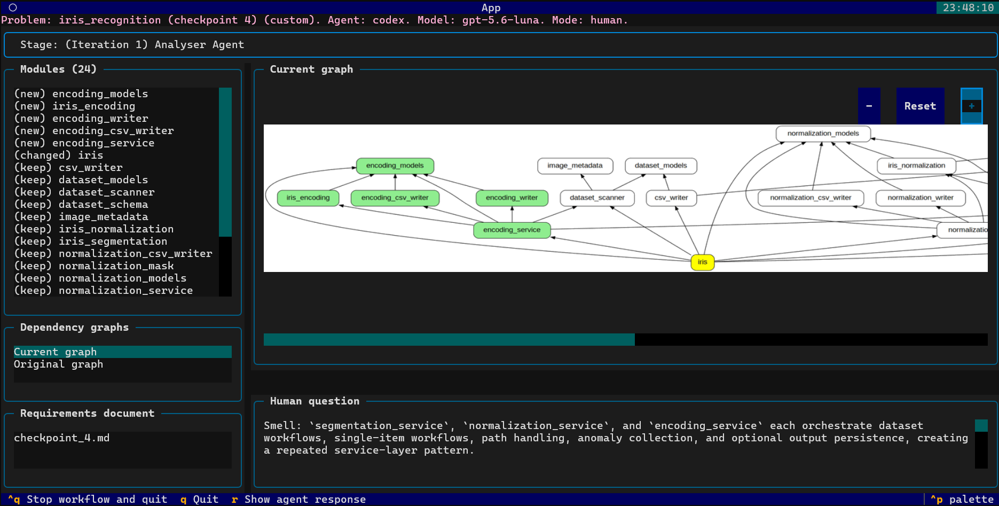

# A Multi-Agent LLM Framework for Maintaining Code Quality in Iterative Software Development

> The project report (pdf) is available [here](Bernard_Moy_Final_Report.pdf).



## Description

With the use of AI coding agents becoming more common in software development,
many have raised concerns about the quality of agent-generated code.
Studies found that they tend to prioritise immediate correctness instead of long term maintainability,
causing the boost in development velocity to gradually vanish over time as technical debt accumulates.

As a result, this project designed a Python-based, multi-agent framework featuring human-in-the-loop,
consisting of specialised LLM agents collaborating across two feedback loop, namely between the decomposer and analyser, and the coder and analyser agents.
The decomposer agent is responsible for high-level and low-level software design, where the analyser would then critic the design and provide suggestions following a set of guidelines and quality metrics.
The correctness and the code quality metrics when the agent extends code written by themselves, are evaluated against the direct-coding and the multi-agent modes, and against human-written popular GitHub repositories.

## Contributions

This project presents the following main contributions:

- Architecture of the multi-agent framework, that can either run automaticallt or feature human-in-the-loop ([workflow.py](modular_main/main/workflow.py)).
- Selected the [SlopCodeBench](https://arxiv.org/pdf/2603.24755) benchmark for evaluation of correctness and the iterative code quality, under the [datasets](datasets/) folder that is excluded from the Git repository.
- Studied the effects of featuring human-in-the-loop using two specialised problems, with their problem checkpoint structures closely resembling that of SlopCodeBench. The problem descriptions are available under the [datasets](datasets/) folder, with the agent implementations available soon.
- Evaluated against direct coding, multi agent, multi agent but without implementation-level metrics (ablation study), and a test-driven development framework modification, under [this notebook](cached_evaluation.ipynb).

# Repo Structure

```text
modular-SWE
├── datasets/  # Custom problems, SlopCodeBench problems (gitignored) and reference GitHub implementations (gitignored)
├── Bernard_Moy_Final_Report.pdf  # Project report pdf
├── Bernard_Moy_Project_Presentation.pdf  # Project presentation pdf
├── cached_evaluation.ipynb  # Evaluation of code quality metrics, using cached values generated with agent implementations
├── evaluation.ipynb  # Evaluation of a single problem. It runs from scratch by reading implementations under datasets/ (which is currently gitignored) and can take up to 30 minutes to generate the results.
├── prompt_generators.ipynb  # Generate full prompts of agents for copy/paste
├── slopCodeBench.ipynb  # SlopCodeBench dataset discovery
├── json_schemas/
│   ├── formatters/
│   │   └── design_formatter.py  # UNUSED: Generate a summary of the design proposed by the decomposer agent
│   ├── analyzer.json  # The schema used as part of the analyser prompt
│   ├── analyzer_code_quality.json  # UNUSED: A schema to prompt the analyzer agent to output a quantifiable code quality score from 1-5. Unused because of the central tendency bias and the threshold being vague.
│   ├── analyzer_pass_fail.json  # UNUSED: A schema to prompt the analyzer agent to output a pass / fail score based on the code quality, unused for the same reason.
│   ├── decomposer.json  # The schema used as part of the decomposer's design output
│   ├── dependency_graph.json  # The schema used as part of the decomposer's dependency graph output
│   └── test_planner.json  # UNUSED: A schema to generate what needs to be tested prior to implementation.
├── metrics/
│   ├── agent_reports/  # UNUSED: Metrics derived from the agent reports, including the agent's activity logs and its running time. Unused because of the randomness.
│   ├── change_coupling/  # Changed proportion, and list which files are changing together which may indicate coupling
│   ├── deps_graph/  # Circular dependency, unstable dependency, hub like, propagation cost, impact size, graph average degree, number of modules
│   ├── design/  # Large public interface
│   ├── designite_py/  # Number of functions, cyclomatic complexity, fan-in/fan-out, and other static analysis warnings
│   ├── jscpd/  # Duplicated lines and tokens
│   ├── pylint/  # UNUSED: Duplicated lines
│   ├── radon/  # Lines of code, comments percentage, weighted maintainability index (MI)
│   └── sonar/  # UNUSED: SonarQube metrics mainly for the cognitive complexity. Unused because of the massive effort to setup docker, and now uses cyclomatic complexity and MI instead.
├── metrics_cache/
│   ├── references_metrics.json  # Cached code quality metrics for referenced GitHub repos.
│   ├── references_metrics_cleaned.json  # UNUSED: Code quality metrics for referenced GitHub repos but with multi-line comments removed. Turns out that is difficult as it breaks the code syntax.
│   ├── scb_metrics.json  # Cached SlopCodeBench chosen problems code quality metrics
│   ├── scb_report_metrics.json  # Cached SlopCodeBench agent report metrics, including the tokens
│   └── scb_test_metrics.json  # Cached SlopCodeBench test correctness metrics measured in pass rates
├── modular_main/
│   ├── BwrapExecutor.py  # A class for running the agent in a BWrap executor to limit what the agent can see
│   ├── auth/codex_login.py  # A class for managing codex login using either API key or chatgpt account
│   ├── entry_files.py  # A list of entry files of the CLI problems given in SlopCodeBench
│   ├── get_prompt_and_run_agent.py  # A helper function that runs the corresponding agent given its name
│   ├── settings.py  # Various settings to configure before running main workflow
│   ├── login.py  # UNUSED: A general login function that supports multiple agents. Since only codex is available, it directly uses the auth/codex_login.py class instead.
│   ├── main/
│   │   ├── custom_tests.py  # UNUSED test script to measure agent effort to fix broken tests under direct / multi agent implementations
│   │   ├── single_prompt.py  # UNUSED test script to test whether calling agent works
│   │   ├── ui.py  # Textual UI Wrapper for the main workflow
│   │   ├── ui.tcss  # Textual UI design styles
│   │   ├── ui_text_formatters.py  # Text formatters to format raw json files to display them better in the UI
│   │   └── workflow.py  # Main workflow, following the architecture
│   └── workspace_helpers/run_agent.py  # Helper function to run the agent given the agent name, model name and the raw text prompt
├── prompts/
│   ├── agent_prompts/
│   │   ├── analyzer.py  # ANALYZER prompt for automatic mode
│   │   ├── analyzer_human.py  # ANALYZER prompt for human-in-the-loop mode
│   │   ├── black_box_test_writer.py  # The TEST PLANNER AGENT prompt mentioned in the report
│   │   ├── coders/
│   │   │   ├── all_at_once_coder.py  # UNUSED prompt following SlopCodeBench's paper
│   │   │   ├── coding_instructions.py  # Reusable coding instructions to ensure code can easily be analyzed later
│   │   │   ├── modular_coder.py  # The CODER AGENT prompt mentioned in the report
│   │   │   ├── no_design_coder.py  # Direct coding agent prompt
│   │   │   ├── refactor_coder.py  # Also the CODER AGENT prompt mentioned in the report but for refactoring
│   │   │   └── test_refactor_coder.py  # The TESTER agent prompt mentioned in the report
│   │   ├── decomposer.py  # DECOMPOSER agent prompt
│   │   ├── rubrics.md  # UNUSED rubrics for thresholding code quality
│   │   ├── scb.py  # UNUSED: SlopCodeBench's original prompts for testing purposes
│   │   ├── test_planner.py  # UNUSED test planner for planning out what to test: For custom / non-CLI problems.
│   │   └── test_writer.py  # UNUSED test writer for writing tests following the plan by test planner: For custom / non-CLI problems.
│   ├── code_quality_pass_fail.py  # UNUSED agent prompt for deciding pass / fail of code quality.
│   ├── criteria.py  # Criteria / guidelines for different agents
│   ├── get_prompt.py  # Central function to get prompts when given the agent names
│   └── json_helper.py  # Helper function to get json string from json schemas
├── reusables/  # Utility helper functions
├── scripts/
│   ├── constants.py  # Ignored files, and the src directory mapping for the referenced GitHub repos (See report appendix)
│   ├── deps_graph.py  # Generate deps graph when given an implementation directory
│   ├── deps_graph_json_to_svg.py  # Convert a deps graph json (adjacency list) to svg for UI display
│   ├── gen_deps_graph_entry.py  # Helper function for deps graph
│   ├── gen_missing_init_files.py  # Helper function for deps graph
│   ├── gen_visibility_matrix.py  # Generate visibility matrix from deps graph json
│   ├── metrics.sh  # Write raw DPy and pylint (unused) metrics given an implementation
│   ├── process_deps_graph.py  # Convert dot file to adjacency list
│   ├── pytest_custom.sh  # Run pytest for custom problems
│   ├── pytest_scb.py  # Run pytest for scb problems
│   └── scb_script.sh  # UNUSED shell script for running the workflow on scb problems using Docker sandbox. If using Claude Code without API, use this
├── validators/module_name_validator.py  # Design validator to prevent hallucination
└── write_metrics/
    ├── write_eval_metrics.py  # Write metrics using the helper functions in metrics/
    ├── ...
    ├── write_references_metrics_json.py  # Write json metrics to the cache under metrics_cache/
    └── ...

```

# Run the Multi-agent Workflow

NOTE: Running the full workflow currently requires the SlopCodeBench dataset to be present and also require the DPy executable, which is currently unavailable.

1. Create a python venv and install the requirements in `requirements.txt`
2. Configure the settings inside `modular_main/settings.py`
3. Run `python -m modular_main.main.workflow <problem> <checkpoint_number>` from the root directory.

# Reproducing the Results

Will be available soon after managing what gets git ignored (26 Sept).
